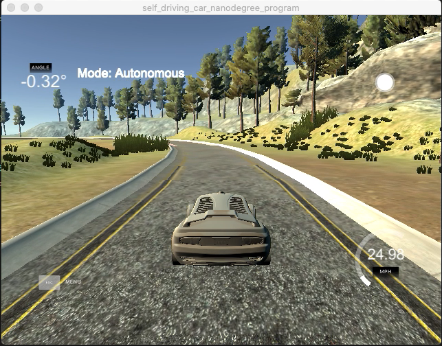
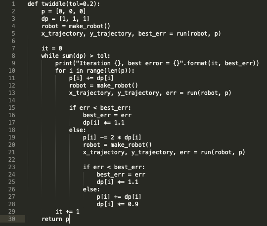

# PID Controller

[](http://www.udacity.com/drive)

---
### Goals
The project goal is to build a Proportional-Integral-Derivative (PID) control for driving the autonomous car around a predefined track. PID is the most common control algorithm used in industry and has been universally accepted in industrial control.
PID algorithm consists of three basic coefficients; proportional, integral and derivative which are varied to get optimal response.



### Environment
The udacity's car simulator provides the cross track error (CTE) and the velocity (mph) in order to compute the appropriate steering angle. the project goal is to use these values are build a PID controller to safely drive the car around the desgined track.

#### CTE: is the cross track error flowing into the controller from our car sensors.
#### Kp, Ki, and Kd are P, I, and D parameters.
#### p_error, i_error, and d_error are proportional, integral and derivative components’ errors respectively.

### Desgin 
Initial valies of PID are imperically found by running the car and manully observering the behavior. The approach for find the values is:

1. First set is to set Ki and Kd values to zero, and only use Kp value until we reach a managable oscillation i.e. car oscillates but stays with the lane for majority of track.
Please see the selected Kp value
[](https://youtu.be/BVALgxNa6v0)

https://youtu.be/BVALgxNa6v0

2. Second step is to find the Kd(Derivative) value to stop the oscillation.

3. Third step is to find a good Ki value to reduce the steady-state error.

The inital values selected for Kp,Ki,Kd are 
[0.08,0.0005,7.5]

### Twiddle
An algorithm that is used to optimized the parameters. This was designed by Sebastian Thrun, Udacity. Please see the below video https://www.youtube.com/watch?v=2uQ2BSzDvXs



I added a new member function to PID controller for Twiddler. The main.cpp is altered to integrate the Twiddle algorithm. The main.cpp run the Twiddle 4 times to find the optimized value. It also controls the timestep/frames before accepting the CTE. The main.cpp also implements a second Twiddle to control the car speed based on difference between the set point speed and current speed. This allows the car to make a safe run around the track. The steering Twiddle turns itself off after running it for 4 times.

Final optimized values are 

[0.09, 0.0005, 7.22648]


Final Video with tuned PID controller:
https://youtu.be/n1RdWRtQgYs


## Basic Build Instructions

1. Clone this repo.
2. Make a build directory: `mkdir build && cd build`
3. Compile: `cmake .. && make`
4. Run it: `./pid`. 

Tips for setting up your environment can be found [here](https://classroom.udacity.com/nanodegrees/nd013/parts/40f38239-66b6-46ec-ae68-03afd8a601c8/modules/0949fca6-b379-42af-a919-ee50aa304e6a/lessons/f758c44c-5e40-4e01-93b5-1a82aa4e044f/concepts/23d376c7-0195-4276-bdf0-e02f1f3c665d)

---
## Dependencies
* cmake >= 3.5
 * All OSes: [click here for installation instructions](https://cmake.org/install/)
* make >= 4.1(mac, linux), 3.81(Windows)
  * Linux: make is installed by default on most Linux distros
  * Mac: [install Xcode command line tools to get make](https://developer.apple.com/xcode/features/)
  * Windows: [Click here for installation instructions](http://gnuwin32.sourceforge.net/packages/make.htm)
* gcc/g++ >= 5.4
  * Linux: gcc / g++ is installed by default on most Linux distros
  * Mac: same deal as make - [install Xcode command line tools]((https://developer.apple.com/xcode/features/)
  * Windows: recommend using [MinGW](http://www.mingw.org/)
* [uWebSockets](https://github.com/uWebSockets/uWebSockets)
  * Run either `./install-mac.sh` or `./install-ubuntu.sh`.
  * If you install from source, checkout to commit `e94b6e1`, i.e.
    ```
    git clone https://github.com/uWebSockets/uWebSockets 
    cd uWebSockets
    git checkout e94b6e1
    ```
* Simulator. You can download these from the [project intro page](https://github.com/udacity/self-driving-car-sim/releases) in the classroom.

## Code Style
[Google's C++ style guide](https://google.github.io/styleguide/cppguide.html).
